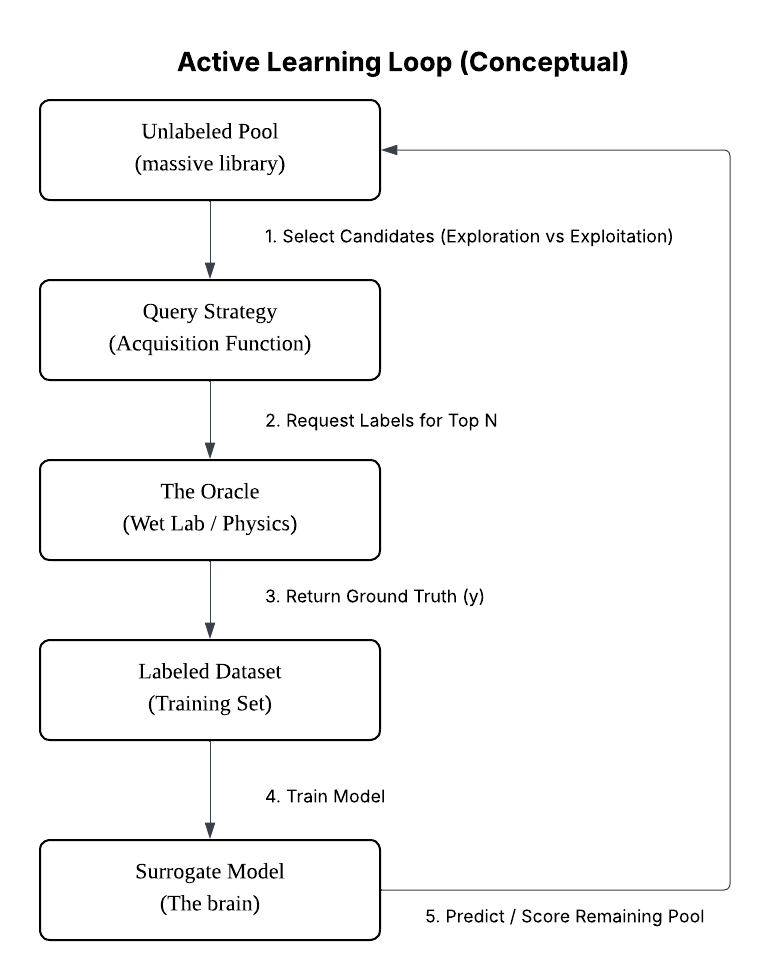
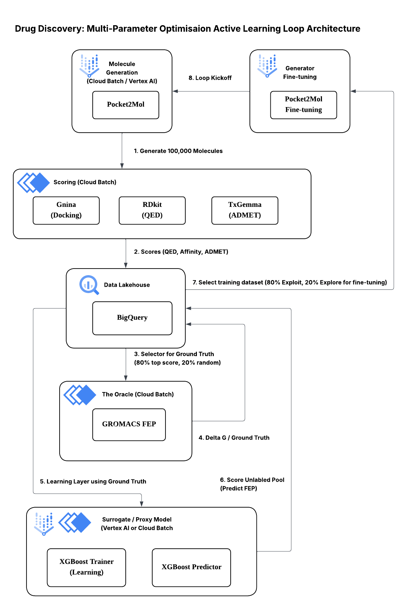

# Cloud-Native Active Learning for Drug Discovery
### 
* **GitHub:** [ryanymt](https://github.com/ryanymt)

## Overview
This repository documents the architecture and results of a **Closed-Loop AI Drug Discovery Platform** built on Google Cloud. 

By orchestrating Generative AI (Pocket2Mol), Physics-Based Simulation (MM-GBSA), and Surrogate Modeling (XGBoost), the platform demonstrates a scalable Active Learning Loop capable of optimizing molecular affinity and properties over successive generation cycles.

*Note: This repository contains architectural documentation and result artifacts. Only the skeleton of development code and container definitions are included.*

### The Active Learning Concept

## Key Results (100k Production Run)

| Metric | Cycle 1 (Baseline) | Cycle 2 (Fine-Tuned) | Improvement |
| :--- | :--- | :--- | :--- |
| **Total Molecules** | 70,259 | 6,853 | -- |
| **Hit Rate (<-30 kcal/mol)** | 92.13% | **94.45%** | +2.32% |
| **Mean Affinity** | -36.68 | **-36.89** | -0.21 kcal/mol | 
| **Gold Rate (Safe + Hit)** | 85.07% | **85.93%** | +0.86% |

* Affinity score are lower the better. 

**Detailed observation** on the **gaps and potential improvements** of this experiment can be found in [10_Observation_notes.md](architecture/10_Observation_notes.md) file. 

*   **High Quality Baseline:** The pre-trained Pocket2Mol model (Cycle 1) already produced high-affinity candidates (-36.68 kcal/mol mean), setting a very high bar.
*   **Incremental Gain:** Fine-tuning on the "Elite" dataset (Cycle 2) shifted the distribution further, improving the Hit Rate to **94.5%** and finding safe, high-affinity candidates at a higher rate.
*   **Scale:** Validated architecture for 100,000+ molecules using Google Cloud Batch.
*   **Efficiency:** Achieved full-loop iteration (Gen -> Oracle -> Train) in **~15 hours** for <$900 USD. Can be scaled to 1000 GPUs and further optimise low GPU utilisation tasks and bring the run durtaion down to **~1 hour** per loop.

## Architecture Highlights
The system implements a specific MPO (Multi-Parameter Optimization) strategy using the following components:

The system is built on a "Lakehouse" pattern using:
*   **Vertex AI Pipelines:** For end-to-end orchestration.
*   **Google Cloud Batch:** For massive parallel docking and FEP simulations (160+ GPUs).
*   **BigQuery:** For structured chemical data analytics.
*   **Google Cloud Storage:** For storing raw data and artifacts.

## Documentation
Dive into the detailed system design:

1.  [Architecture Overview](architecture/00_Architecture_Overview.md) - High-level diagrams and flow.
2.  [Generative Engine](components_notes/01_Pocket2Mol_Generator.md) - Pocket2Mol fine-tuning process.
3.  [The Oracle](components_notes/03_Oracle_MM-GBSA.md) - Using GROMACS MM-GBSA as Ground Truth.
4.  [The Critic](components_notes/04_Proxy_Model_XGBoost.md) - Surrogate modeling for rapid screening.
5.  [Strategy: Diversity](architecture/03_Strategy_Mode_Collapse.md) - Mitigating mode collapse in generative models.
6.  [Engineering Log](architecture/01_engineering_notes.md) - Detailed run notes.

## Results
See the full analysis in the evaluation notebook: [results_100k/cycle2_evaluation.ipynb](results_100k/cycle2_evaluation.ipynb).

---
