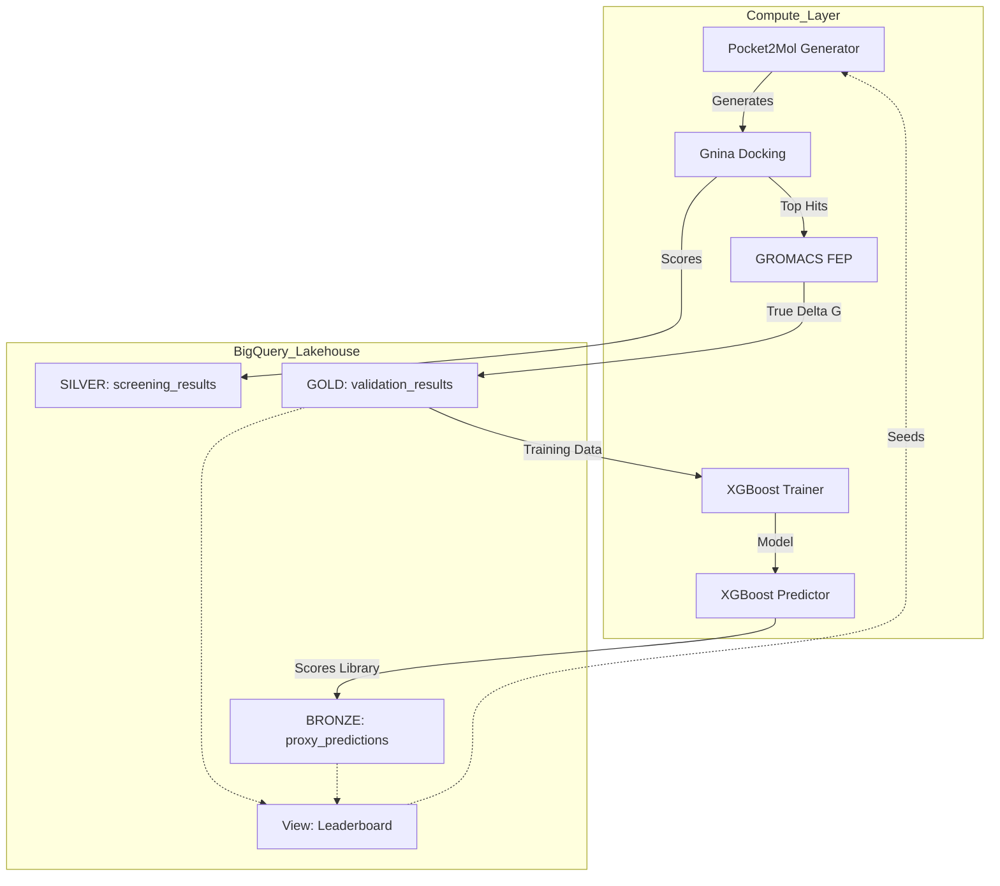

# BioOps Data Lakehouse Architecture: The "Tiers of Truth" Strategy

## 1. Executive Summary
This document defines the BigQuery (BQ) architecture for the BioOps Drug Discovery Platform. The core design principle is **"Separation of Fidelity."** We must rigorously distinguish between ground-truth physics simulations (Teacher) and machine learning predictions (Student).

**Final Objective:** Enable the "Active Learning Loop" where high-fidelity data selectively retrains low-fidelity models to accelerate the discovery of optimal drug candidates.

---

## 2. Dataset Structure
We will use **Single Project** scoped to a **Single Dataset** to ensure atomic transactions and simplified IAM (Identity and Access Management).

*   **Project:** `lifescience-project-469915` (Production)
*   **Dataset ID:** `bioops_platform`
*   **Location:** `US` (or user's preferred region, must match GCS buckets)

---

## 3. Table Specifications
We classify data into three tiers based on reliability and cost of acquisition.

### Tier 1: GOLD (The Teacher's Ledger) - `validation_results`
*   **Source:** GROMACS / FEP (Free Energy Perturbation).
*   **Nature:** Expensive, sparse, high-fidelity physics data. **Immutable Fact.**
*   **Retention:** Permanent.
*   **Used For:** Training the Proxy Model (Student).

| Field Name | Type | Description |
| :--- | :--- | :--- |
| `molecule_hash` | STRING | **PK**. SHA256 of Canonical SMILES. |
| `smiles` | STRING | The chemical structure. |
| `delta_g` | FLOAT | The Free Energy of Binding (kcal/mol). The "Target". |
| `uncertainty` | FLOAT | Error estimate from the simulation. |
| `run_id` | STRING | Vertex Pipeline Run ID (Traceability). |
| `timestamp` | TIMESTAMP | When the validation finished. |
| `trajectory_uri` | STRING | GCS path to the simulation trajectory (`.xtc`). |

### Tier 2: SILVER (The Filter's Log) - `screening_results`
*   **Source:** Gnina (Molecular Docking).
*   **Nature:** Fast, medium-fidelity geometric data.
*   **Retention:** Permanent (valuable for analysis).
*   **Used For:** Filtering candidates before expensive FEP.

| Field Name | Type | Description |
| :--- | :--- | :--- |
| `molecule_hash` | STRING | **PK**. SHA256 of Canonical SMILES. |
| `smiles` | STRING | The chemical structure. |
| `cnn_score` | FLOAT | Gnina CNN Score (0-1). |
| `affinity` | FLOAT | Vina Affinity Score. |
| `run_id` | STRING | Vertex Pipeline Run ID. |
| `pose_uri` | STRING | GCS path to the docked pose (`.sdf`). |

### Tier 3: BRONZE (The Student's Notebook) - `proxy_predictions`
*   **Source:** XGBoost (Proxy Model).
*   **Nature:** Instant, low-fidelity predictions. **Ephemeral.**
*   **Retention:** Rolling (older loop predictions are less relevant).
*   **Used For:** Dense Scoring of the massive library to guide the next generation.

| Field Name | Type | Description |
| :--- | :--- | :--- |
| `molecule_hash` | STRING | **PK**. SHA256 of Canonical SMILES. |
| `smiles` | STRING | The chemical structure. |
| `predicted_delta_g`| FLOAT | The Proxy's "Best Guess" of Delta G. |
| `model_version` | STRING | e.g., `xgboost_loop_05` (Critical for tracking learning). |
| `run_id` | STRING | Vertex Pipeline Run ID. |

---

## 4. The Unified View (The "Brain's Eye")
The Generator (Pocket2Mol) needs a holistic view of "What is good?" regardless of source.

### View: `v_comprehensive_leaderboard`
Logic: "Show me the best molecules, preferring Gold Truth over Bronze Guesses."

```sql
SELECT
    molecule_hash,
    smiles,
    delta_g AS score,
    'GOLD' AS source,
    run_id
FROM `bioops_platform.validation_results`
WHERE delta_g IS NOT NULL

UNION ALL

SELECT
    molecule_hash,
    smiles,
    predicted_delta_g AS score,
    'BRONZE' AS source,
    run_id
FROM `bioops_platform.proxy_predictions`
-- Only include predictions for molecules we HAVEN'T validated yet
WHERE molecule_hash NOT IN (SELECT molecule_hash FROM `bioops_platform.validation_results`)
```

---

## 5. Developer Implementation Guide

### A. The "Joiner" Component (`join_results.py`)
**Role:** The Router.
The component that runs after the batch jobs must:
1.  Read the output JSONs from the cloud storage bucket.
2.  Add the `run_id` and metadata.
3.  **Route the writes:**
    *   If coming from `run_fep_parallel` -> Insert into `validation_results` (GOLD).
    *   If coming from `gnina_docking` -> Insert into `screening_results` (SILVER).
    *   If coming from `predict_batched` -> Insert into `proxy_predictions` (BRONZE).

### B. The XGBoost Trainer (`train_proxy.py`)
**Role:** The Student.
*   **Input:** Queries BQ `validation_results` (GOLD) to get `X=smiles`, `y=delta_g`.
*   **Action:** Trains a new model `xgboost_loop_N`.
*   **Output:** Saves model artifact to GCS (Registry).

### C. The Pocket2Mol Generator (`sample.py`)
**Role:** The Source.
*   **Input:** Queries `v_comprehensive_leaderboard` to find high-scoring "Parents" (seeds) for the next generation.

---

## 6. Architecture Diagram (Data Flow)


