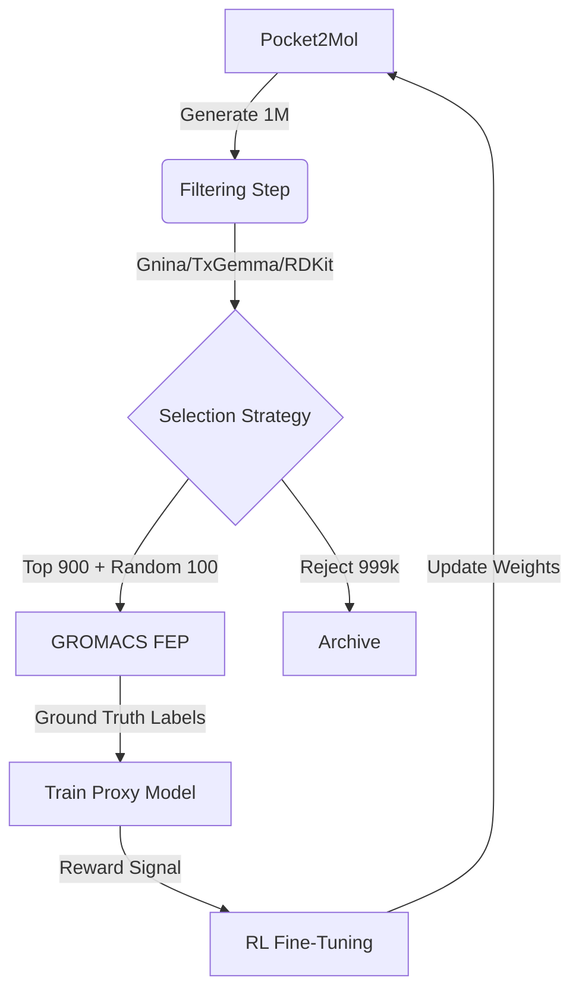

# Active Learning Loop Architecture

## Goal
To iteratively improve the generation of drug candidates by learning from high-fidelity simulations (FEP) while minimizing computational costs.

## The Closed-Loop Flow

The cycle consists of 6 distinct phases run sequentially.

### 1. Generation Phase (High Throughput)
*   **Component**: Pocket2Mol (Generator)
*   **Action**: Generate a massive batch of candidates.
*   **Volume**: ~1,000,000 molecules.
*   **Purpose**: Explore the chemical space broadly around the protein pocket.

### 2. Filtering Phase (Fast Scouting)
*   **Components**:
    *   **Gnina**: Docking score (Binding Affinity estimate).
    *   **TxGemma**: ADMET properties (Toxicity, absorption).
    *   **RDKit**: QED (Drug-likeness) and SA (Synthesizability).
*   **Action**: Score all 1M molecules in parallel.
*   **Output**: A ranked list of 1M molecules with rough scores.

### 3. Selection Phase (The Query Strategy)
*   **Component**: Selector (Python Script / Vizier)
*   **Strategy**: **Exploitation + Exploration**.
    *   **Top 900**: Select the best scoring molecules from Phase 2.
    *   **Random 100**: Select random molecules to ensure diversity and prevent mode collapse.
*   **Volume**: 1,000 molecules.
*   **Purpose**: Identify the most valuable candidates for expensive labeling.

### 4. Ground Truth Phase (The Labeler)
*   **Component**: GROMACS FEP (Free Energy Perturbation)
*   **Action**: Run rigorous thermodynamic simulations on the selected 1,000 candidates.
*   **Output**: High-accuracy Binding Free Energy ($\Delta G$) labels.
*   **Cost**: High (GPU-intensive), hence limited to 1,000 samples.

### 5. Proxy Training Phase (The Surrogate)
*   **Component**: XGBoost (Proxy Model)
*   **Action**: Train on the new 1,000 FEP labels (accumulated with previous cycles).
*   **Input**: Molecular fingerprints (RDKit) -> Target: FEP $\Delta G$.
*   **Result**: A fast predictive model that approximates the expensive FEP simulation.

### 6. Generator Update Phase (The Brain)
*   **Component**: Pocket2Mol (RL Fine-Tuning)
*   **Action**: Update the generator's neural network weights.
*   **Mechanism**: **Reinforcement Learning**.
    *   Pocket2Mol generates a small batch.
    *   **Proxy Model** scores them (Reward Function).
    *   **Gradient Ascent**: Maximize the expected Reward.
*   **Outcome**: The generator "learns" to produce molecules that are likely to have good FEP scores in the next cycle.

## Visual Workflow

## Implementation Plan (Summary)
1.  **Orchestrator**: `active_learning_loop.py` manages the cycles.
2.  **Pipeline**: `al_pipeline_def.py` executes Steps 1-5.
3.  **Fine-Tuning**: A separate job (Step 6) takes the trained proxy and updates Pocket2Mol.
