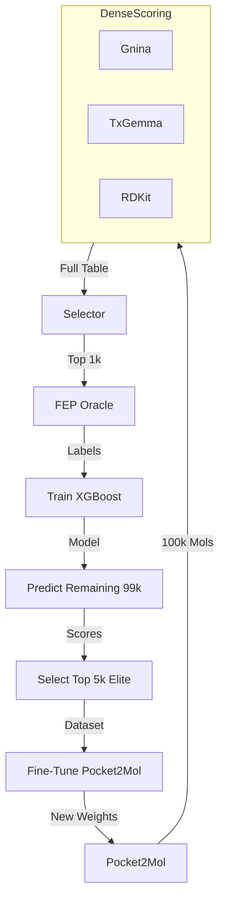

# Active Learning & Fine-Tuning Strategy

## 1. Multi-Parameter Optimization (MPO) Architecture

Our pipeline moves beyond simple linear filtering to a robust MPO approach. We evaluate candidates across multiple dimensions to identify high-quality drug candidates that balance affinity, safety, and developability.

### The Flow
1.  **Massive Generation:** Pocket2Mol generates a large batch (e.g., **100,000** molecules).
2.  **Dense Scoring:** Every single molecule is scored in parallel:
    *   **Gnina:** Binding Affinity / Docking Score.
    *   **TxGemma:** ADMET / Toxicity prediction.
    *   **RDKit:** QED (Quantitative Estimate of Drug-likeness) and SA (Synthetic Accessibility).
3.  **Selection (The Query Strategy):**
    *   A Selector component picks **1,000** molecules for High-Fidelity labeling.
    *   **Strategy:** 90% Exploitation (Best MPO Scores) + 10% Exploration (Random/High Uncertainty) to prevent mode collapse.
4.  **Oracle Labeling:**
    *   The selected 1,000 molecules are sent to the FEP Engine (Real or Mock) to get the "Ground Truth" $\Delta G$.
5.  **Proxy Training:**
    *   An **XGBoost** model is trained on the Oracle data (Features: Morgan Fingerprints $\to$ Target: FEP $\Delta G$).
    *   *Result:* A fast surrogate model that approximates the expensive physics engine.

---

## 2. Pocket2Mol Fine-Tuning Strategy

The core objective is to update the Generator (Pocket2Mol) so that the *next* batch of 100,000 molecules is better than the last. We considered two approaches:

### Option A: Reinforcement Learning (Policy Gradient) - *Advanced*
*   **Mechanism:** Treat molecule generation as a trajectory. Use the Proxy Model (XGBoost) as a reward function. Update weights using gradients (REINFORCE/PPO) to maximize expected reward.
*   **Pros:** Can discover novel chemical space; directly optimizes the objective.
*   **Cons:** Highly unstable; computationally expensive; requires complex integration of RL libraries with the Generator.

### Option B: Weighted Retraining (Supervised Fine-Tuning) - *Chosen for MVP*
*   **Mechanism:**
    1.  Use the trained XGBoost model to predict FEP scores for the remaining **99,000** unlabeled molecules.
    2.  Combine these predictions with the hard constraints (TxGemma/RDKit).
    3.  Select the **"Elite Set"** (e.g., Top 5,000) that have the best predicted profile.
    4.  Fine-tune Pocket2Mol using standard Supervised Learning (Maximum Likelihood) on this Elite Set.
*   **Pros:** Stable, robust, easy to implement, computationally efficient.
*   **Cons:** Limited to the chemical space already explored (but iterating cycles solves this).

### **Decision: Option B (Weighted Retraining)**
We have selected **Weighted Retraining** for the MVP.
*   **Why:** It minimizes engineering risk while providing a mathematically sound "Hill Climbing" capability. It allows us to close the loop immediately without debugging unstable RL gradients.

---

## 3. Data Flow Diagram



```